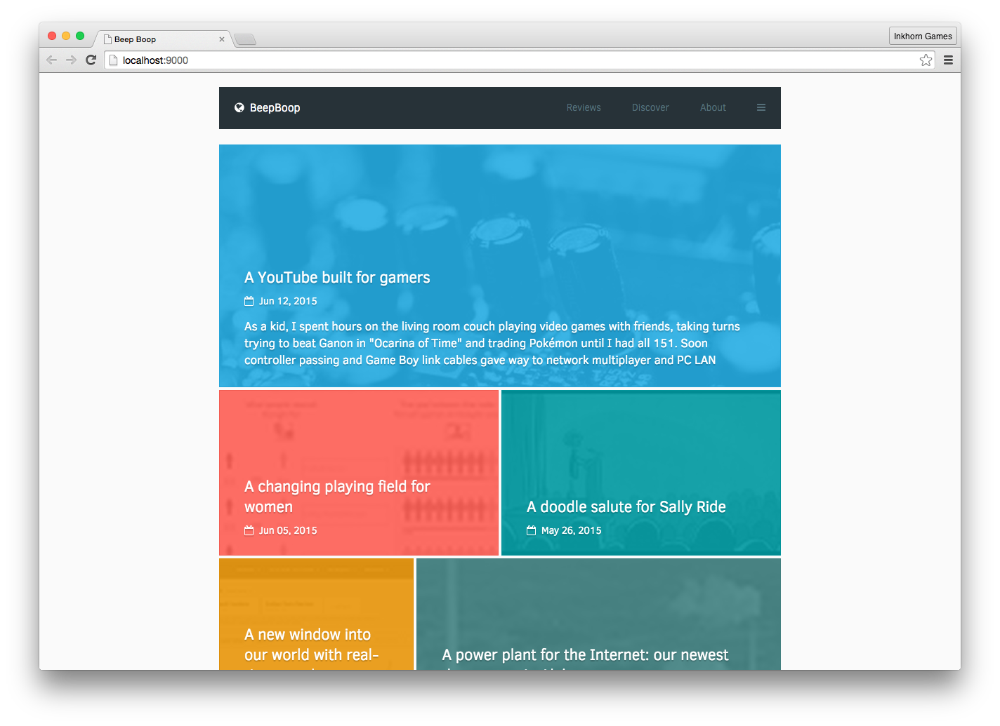
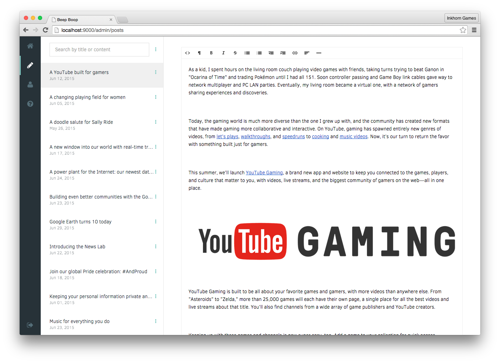

angular-blog
--------------------
{{ fancy travis/npm/etc badges to come soon }}

### Preview of Homepage and Admin


## Demo
Demo: [angular-blog-demo.herokuapp.com](https://angular-blog-demo.herokuapp.com)

## Description
Built using Yeoman and the Angular-FullStack generator. Utilizes the following 'options' from the generator...

- MongoDB w/ Mongoose ORM
- OAuth
- Socket.IO
- Angular w/ uiRouter instead of ngRoute

#### PreProcessor Languages
- Jade
- Stylus
- Coffeescript

## Features
- [ ] !IMPORTANT - Generalize internal naming and references
- [ ] Nested Comments
- [ ] Admin Password Reset Functionality
- [ ] Add Like to Post
- [ ] Add like to Comments

## How to run the project
### I. Install the DB
1. Install Brew ([homepage](http://brew.sh/))
2. Install mongod using this command ```brew install mongodb```
3. Set permissions to the data directory (if needed) ```sudo chmod 0755 /data/db```
4. Run mongod ```mongod```

### Install Node and Bower Packages
1. In a terminal window, navigate to the app's folder.
2. Optional: Run ```rm -rf node_modules && npm cache clean```
3. Run ```npm install```
4. Run ```bower install```
3. Done!

### II. Run the app
1. Run ```grunt``` to confirm everything builds correctly. For Unit Test failures; you can add an optional ```-f``` to force.
2. Then run ```grunt serve``` to see everything run!
3. That's it :)


## Configuration Details
In order to have the site operate expectedly environment variables are used. These are defined in `server > config > environment`. You can set local environment variables for testing by creating a 'local.env.js' file within the `server > config` directory; a sample is available for reference!

On every environment the following ENV_VARS must be set...
- S3_FOLDER
- S3_BUCKET
- S3_KEY
- S3_SECRET
- NODE_ENV (must be 'production' outside of local testing)

## Brought to you by [Inkhorn Games](http://www.inkhorngames.com)
Developed for our upcoming game Order of Ancients ([subreddit](http://www.reddit.com/r/orderofancients)).

Connect with us:
[Facebook](https://www.facebook.com/inkhorngames) | [Twitter](https://twitter.com/inkhorngames) | [Youtube](http://youtube.com/inkhorncompany)
